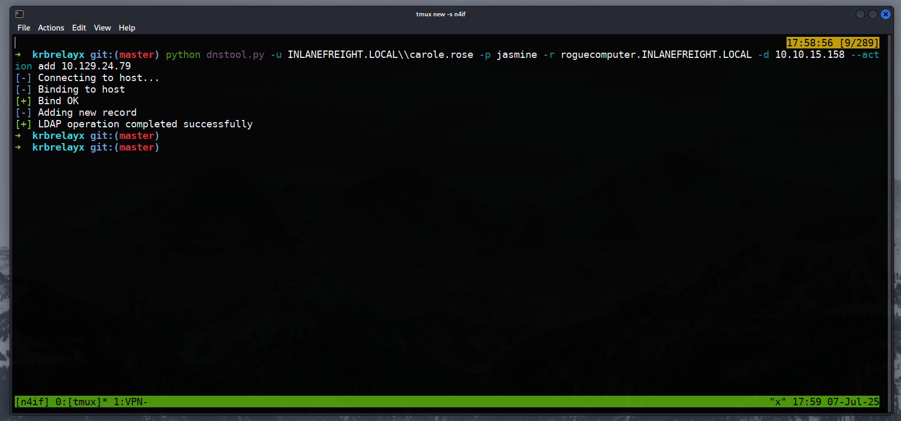

## INTRO
Hi all, I finished Kerberos module in HTB academy and it inspires me to write this article or blog idk. Why? this attack really cool because I love how connectivity of it and testing your knowledge in how the AD features can combine together to craft attack that lead to DC TGT then using DCSync to dump any NTLM hash user, even krbtgt user

>If you are reading this and don't understand how Kerberos works, you are in for a headache just like what I'm experiencing with the HTB model.

So, this attack is all about when you found Unconstrained delegation `user` not computer. As I know in Unconstrained delegation `computer` you need to get inside that host that have this feature with high privilege user to start monitor using Rubeus.exe for any user-login so you can capture the TGT or you can force a DC to authenticate to the compromised host to get the DC TGT < easy path.

But in Unconstrained delegation `user` is different approach. 

The problem:
How do you get someone to authenticate to a user?
> Computer is normal to authenticate to it but user is not normal

let's call the Unconstrained delegation user as `sqldev`

Here's the trick. We can't make the DC talk to a user, but we can make it talk to a server. So, we're going to put a fake server mask on our user, sqldev.  
We do this by editing sqldev's SPN to say he is now also roguecomputer. When we force the DC to authenticate to roguecomputer, it's actually sending its TGT straight to our user, sqldev, letting us steal it.

## Prerequisites
What do you need first?
1. **A compromised user (sqldev)** that has the TRUSTED_FOR_DELEGATION flag set. You need to know this user's password hash.
2. **Another compromised user (carole.rose)** that has permission to create DNS records and modify the SPNs of the sqldev account. This is a crucial.

> So, how do you find this user who can edit sqldev? By enumerating DACLs. You need to look for a user that has permissions like GenericWrite on the sqldev account. We have carole.rose

>Since carole.rose have ACL right over sqldev, he can do Shadow Credential to get NTLM for the sqldev user

**Now let's chain the attacks together. the cool part we will do it remotely from Kali Linux.**

## (1) Starting with DNS

Create a DNS "A" record for a non-existent computer (roguecomputer) that points to **My Kali machine**. We send this request to the DC
it mean. Hey DC if you see roguecomputer.INLANEFREIGHT.LOCAL it means 10.10.15.158 which is my Kali IP address. **the request must be sent to a Domain Controller.**

You can check if it's updated the DNS or not:  

## (2) Hide the fake computer in sqldev
  
Now, we will tell AD that the user sqldev is now the service account responsible for handling file sharing (CIFS) requests for roguecomputer. You can do this by adding SPN to his account (sqldev).
>Using my carole.rose that have ACL over sqldev to edit he's SPN so we can add our fake computer to he's list

**Why:** Now, when a user wants to connect to \\\roguecomputer, the KDC knows that the service ticket for this request must be encrypted with **sqldev's password hash**.

>I have to clarify something that I learned from the module; TGS is encrypted within the service account e.g (sqldev). we will use this advantage later

## (3) Set up the Listener

Start a listener that will act as the fake roguecomputer SMB service and is capable of decrypting the tickets it receives. Why? because we will force the DC to send he's TGT to us and we will use the sqldev hash to decrypt it.  
Because sqldev is trusted for Unconstrained Delegation, this ticket will contain a copy of the authenticating user's TGT. krbrelayx is designed to automatically extract this TGT.  
**Tool:** krbrelayx.py

## (4) Force a Privileged Account to Authenticate

I will target DC using The Printer Bug This coerces the DC to try and authenticate to roguecomputer over SMB.   
Guess who behind the roguecomputer? The Hacker Man

## (5) The Payoff

It automatically saves this TGT to a `.ccache` file. from Kali we can import the powerful DC TGT to our session and work remotely. using -K for kerberos authenticate and -no-pass to stop the regular authenticate  
     
  
## Mitigations

I don't like blue team employees   
I WILL NOT LET THEM RUIN MY FUN  

resource: https://academy.hackthebox.com/module/details/25  

>Thank u for reading  
_Note: if there is any inaccuracies, please DM in LinkedIn_
 

